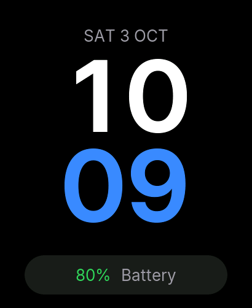
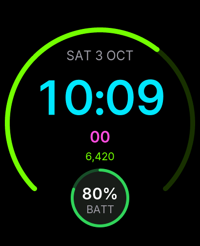
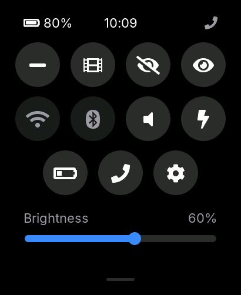
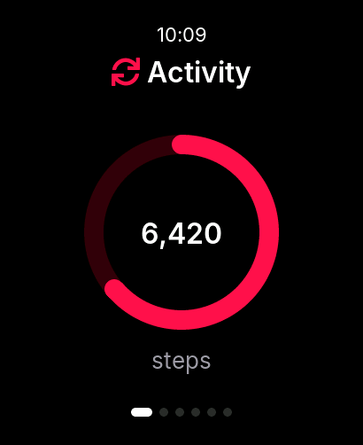
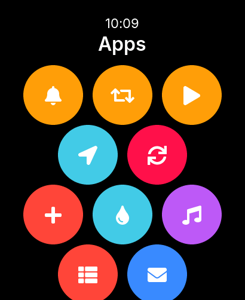
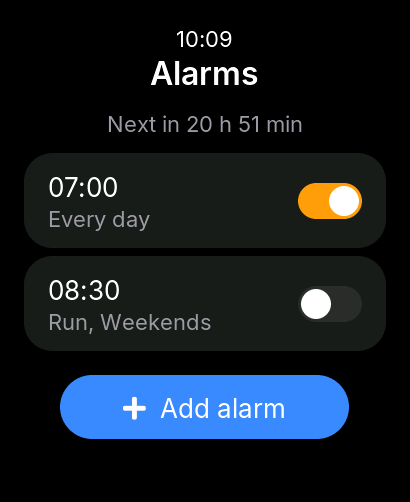
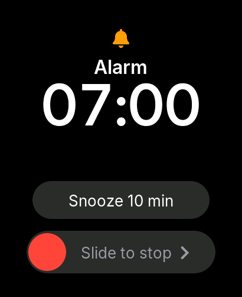
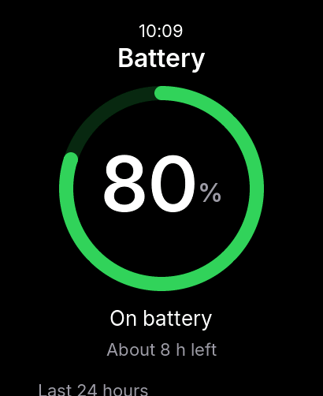
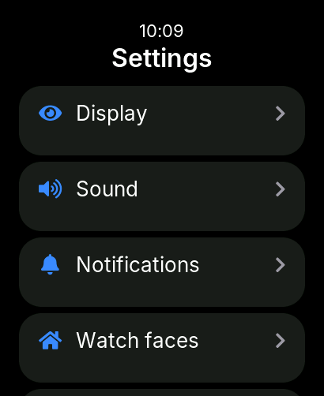

# S3Wear Community

Open-source smartwatch OS for the **Waveshare ESP32-S3-Touch-AMOLED-2.06**. A complete standalone watch: watch faces with always-on display, raise to wake, alarms that wake the watch from deep sleep, timers, stopwatch, world clock, do-not-disturb / sleep / theater modes, battery management and an on-watch Settings app. Every screen also runs in a desktop simulator.

Status: Phases 0–3 done (M1 "It's a watch"). Next: a basic Android companion for pairing, time sync and the watch battery. See the [roadmap](docs/09-roadmap-tasks.md).

## Screenshots

From the SDL2 simulator at the panel's native 410×502. These are the UI snapshot test goldens in [firmware/test/ui_snapshots/](firmware/test/ui_snapshots/).

| | | | |
|---|---|---|---|
|  |  |  |  |
|  |  |  |  |
|  |  |  |  |

## Build

```bash
# Firmware (ESP-IDF v5.5.x exported)
cd firmware && idf.py set-target esp32s3 && idf.py build
idf.py -p /dev/cu.usbmodem* flash monitor

# Simulator (SDL2) and its snapshot tests
cmake -S firmware/simulator -B build/sim && cmake --build build/sim && ./build/sim/s3w_sim
ctest --test-dir build/sim

# Host unit tests
cmake -S firmware/host_test -B build/host_test && cmake --build build/host_test && ctest --test-dir build/host_test
```

More commands and the coding rules: [CLAUDE.md](CLAUDE.md).

## Documentation

| Document | Purpose |
|---|---|
| [PLAN.md](PLAN.md) | Vision, scope, key decisions, repo layout, roadmap — start here |
| [CLAUDE.md](CLAUDE.md) | Rules for AI agents (and humans) working in this repo |
| [docs/01-hardware.md](docs/01-hardware.md) | Hardware inventory, pin map, I2C map, gotchas |
| [docs/02-firmware-architecture.md](docs/02-firmware-architecture.md) | Layers, tasks, memory, power, storage, security |
| [docs/03-firmware-features.md](docs/03-firmware-features.md) | Spec for every user-facing watch feature |
| [docs/04-ui-ux.md](docs/04-ui-ux.md) | Design system and navigation model (410×502 AMOLED) |
| [docs/06-ble-protocol.md](docs/06-ble-protocol.md) | Watch ↔ phone protocol (GATT, framing, protobuf) |
| [docs/07-android-app.md](docs/07-android-app.md) | Basic Android companion (planned) |
| [docs/08-quality-ci-release.md](docs/08-quality-ci-release.md) | Testing, CI, release |
| [docs/09-roadmap-tasks.md](docs/09-roadmap-tasks.md) | Task backlog with acceptance criteria |
| [docs/bringup-phase1.md](docs/bringup-phase1.md) | Board bring-up checks |

## Repository layout

| Path | Contents |
|---|---|
| [firmware/](firmware/) | ESP-IDF project: `main/`, `components/`, `simulator/` (SDL2), `test/` (UI scenarios and goldens), `host_test/` (GoogleTest) |
| [protocol/](protocol/) | `.proto` sources and golden test vectors (for the companion) |
| [android/](android/) | Companion app skeleton (Kotlin, Jetpack Compose) |
| [tools/](tools/) | Font converter, protocol codegen |

## Licence

Code: [Apache-2.0](LICENSE). Docs: [CC-BY-4.0](LICENSE-DOCS). Not affiliated with Waveshare.
