# S3Wear Community

Open-source smartwatch OS for the **Waveshare ESP32-S3-Touch-AMOLED-2.06**. A complete standalone watch: watch faces with always-on display, raise to wake, alarms that wake the watch from deep sleep, timers, stopwatch, world clock, do-not-disturb / sleep / theater modes, battery management and an on-watch Settings app. Every screen also runs in a desktop simulator.

Status: Phases 0–3 (M1 "It's a watch").

This is the **Community edition**. It is published from a private source repository, one commit per release (see [CONTRIBUTING.md](CONTRIBUTING.md)). The paid **Pro edition** adds the phone link features (notifications, weather, media, calendar, calls, Find phone, Home Assistant, voice memos, Wi-Fi), the Android companion app, installable mini apps and games with an SDK, the app store and signed OTA updates. The Community edition has no installable apps or games.

## What the Community edition has
- Watch faces (native and declarative `face.json`) with always-on display and raise to wake.
- Quick settings, tiles, launcher, alarms, timer, stopwatch, world clock.
- Do-not-disturb, sleep and theater modes, battery and charging screens, on-watch Settings, system sounds.
- USB mass storage for side-loading faces.

## Screenshots

From the SDL2 simulator at the panel's native 410×502, Community build. These are the UI snapshot test goldens in [firmware/test/ui_snapshots/community/](firmware/test/ui_snapshots/community/).

| | | | |
|---|---|---|---|
|  | 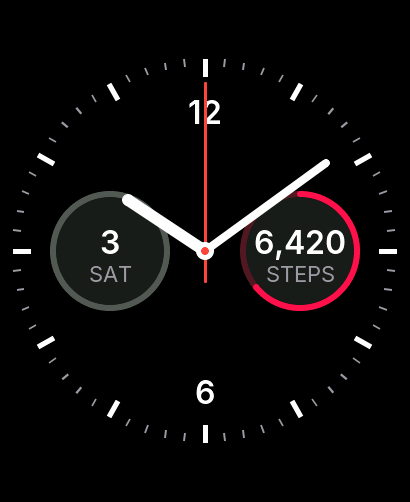 | 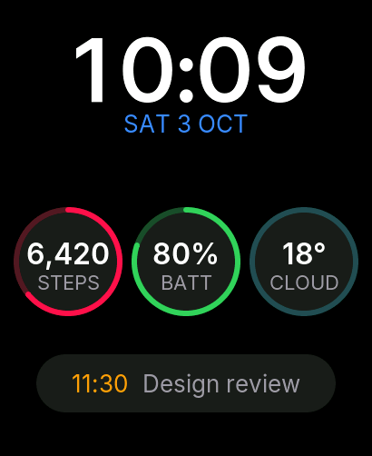 |  |
| 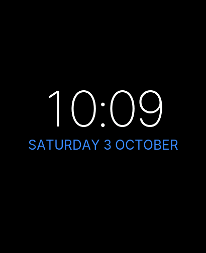 | 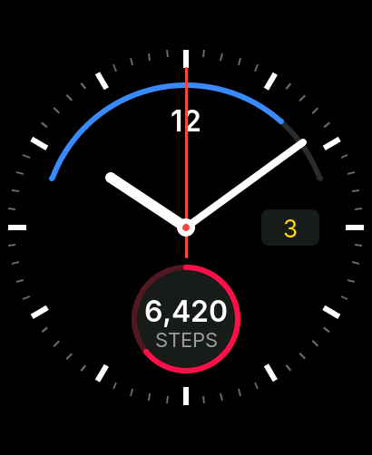 | 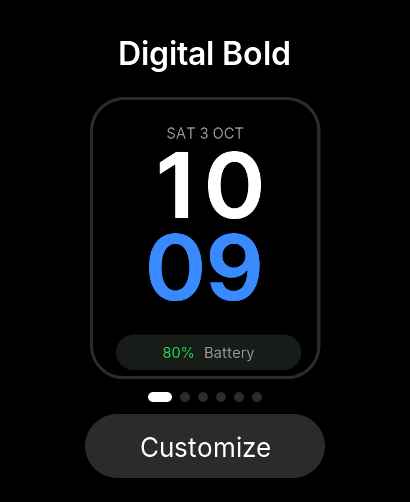 | 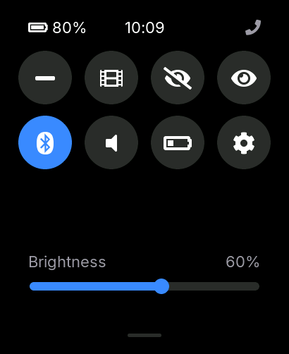 |
| 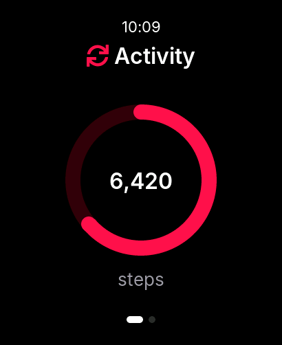 | 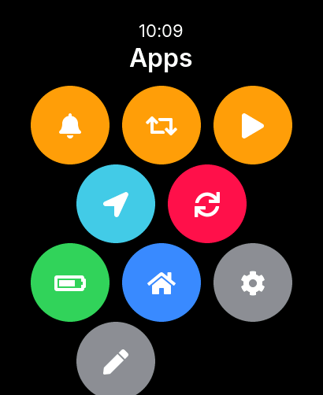 | 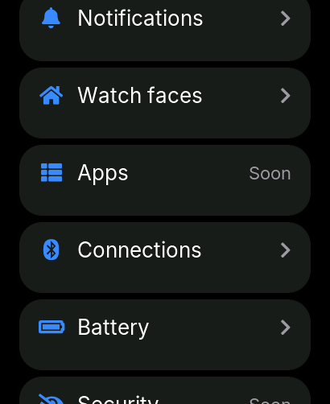 | 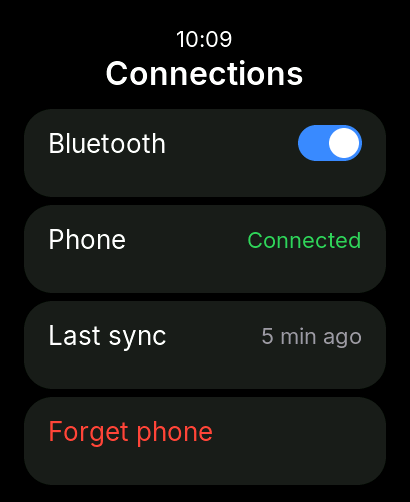 |
|  | 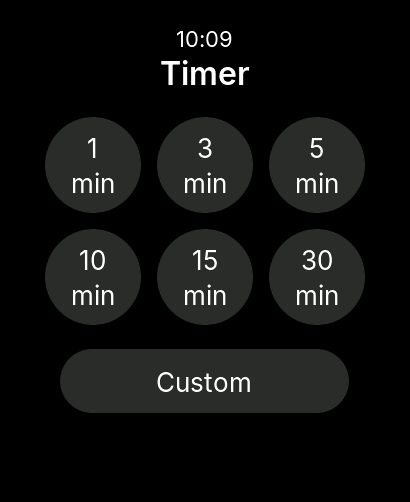 | 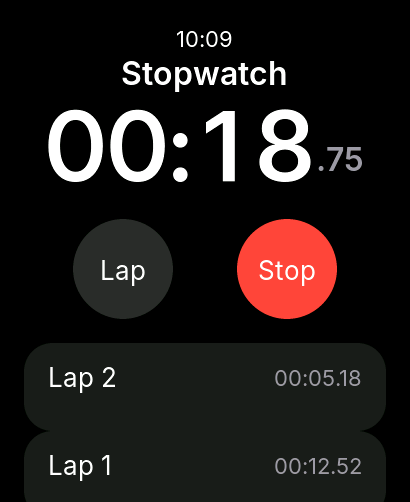 | 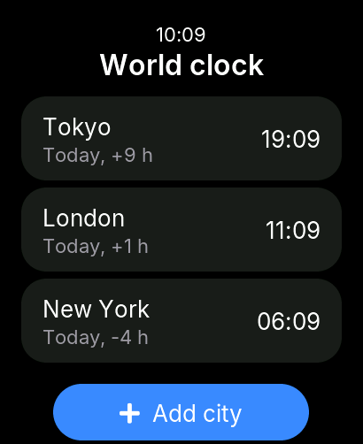 |
|  | 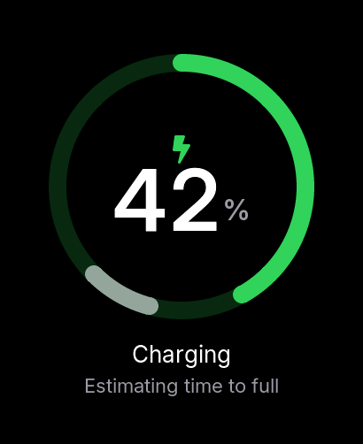 |  |  |

## Build

```bash
# Firmware (ESP-IDF v5.5.x exported)
cd firmware && idf.py set-target esp32s3 && idf.py build
idf.py -p /dev/cu.usbmodem* flash monitor

# Simulator (SDL2) and its snapshot tests
cmake -S firmware/simulator -B build/sim && cmake --build build/sim
./build/sim/s3w_sim
ctest --test-dir build/sim

# Host unit tests
cmake -S firmware/host_test -B build/host_test && cmake --build build/host_test && ctest --test-dir build/host_test
```

CI builds the firmware and runs the host and snapshot tests on every push ([.github/workflows/ci.yml](.github/workflows/ci.yml)).

## Documentation

| Document | Purpose |
|---|---|
| [docs/01-hardware.md](docs/01-hardware.md) | Hardware inventory, pin map, I2C map, gotchas |
| [docs/bringup-phase1.md](docs/bringup-phase1.md) | Board bring-up checks |
| [docs/vendor/README.md](docs/vendor/README.md) | Vendor references and values taken from them |
| [protocol/](protocol/) | `.proto` sources and golden test vectors |

## Repository layout

| Path | Contents |
|---|---|
| [firmware/](firmware/) | ESP-IDF project: `main/`, `components/`, `simulator/` (SDL2), `test/` (UI scenarios and goldens), `host_test/` (GoogleTest) |
| [protocol/](protocol/) | Watch ↔ phone protocol sources |
| [tools/](tools/) | Font generator |

Some Pro-only components appear as empty stubs under `firmware/components/` so the build files stay identical in both editions.

## Licence

Code: [Apache-2.0](LICENSE). Docs: [CC-BY-4.0](LICENSE-DOCS). Contributions need the [CLA](CLA.md). Not affiliated with Waveshare.
